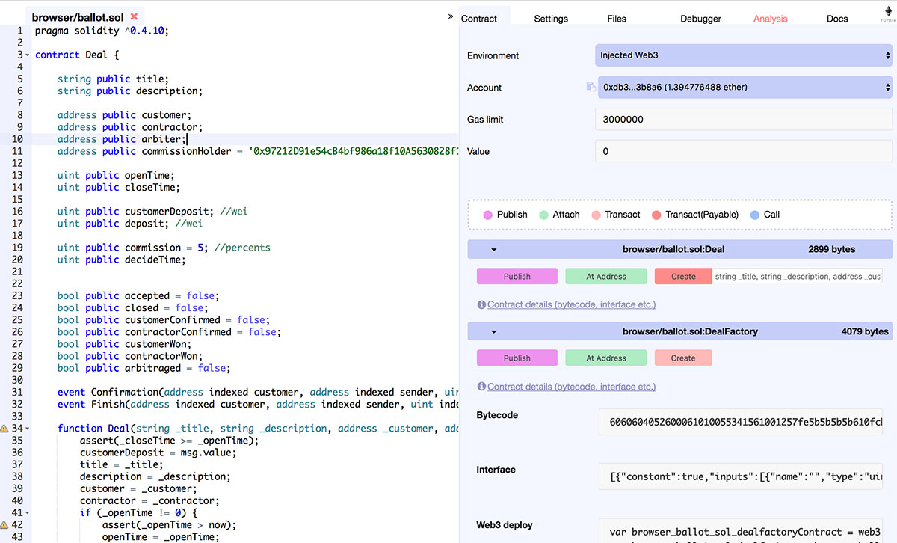
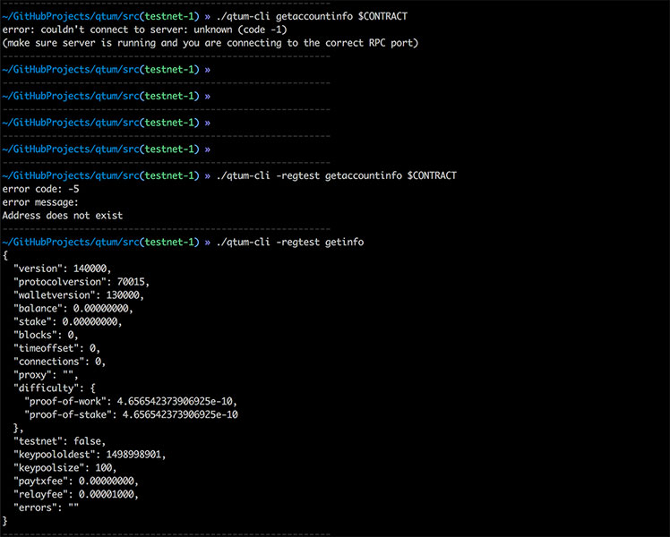
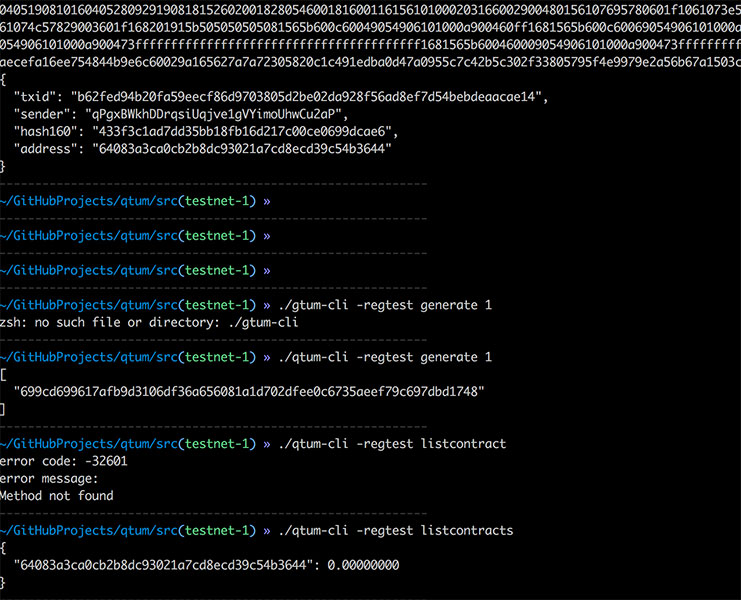
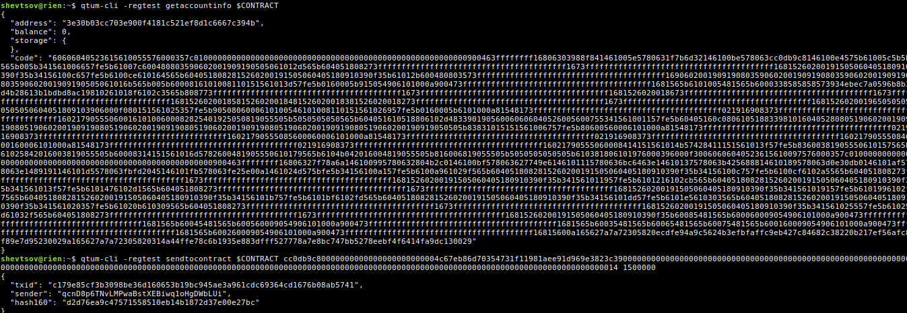

# Qtum Realisation

* We developed the prototype based on [front-end app](https://github.com/BlockJudge/BlockJudge). 

  

* We setup Qtum environment, deployed our contracts, successfully interacted with CLI.

  

  

  

